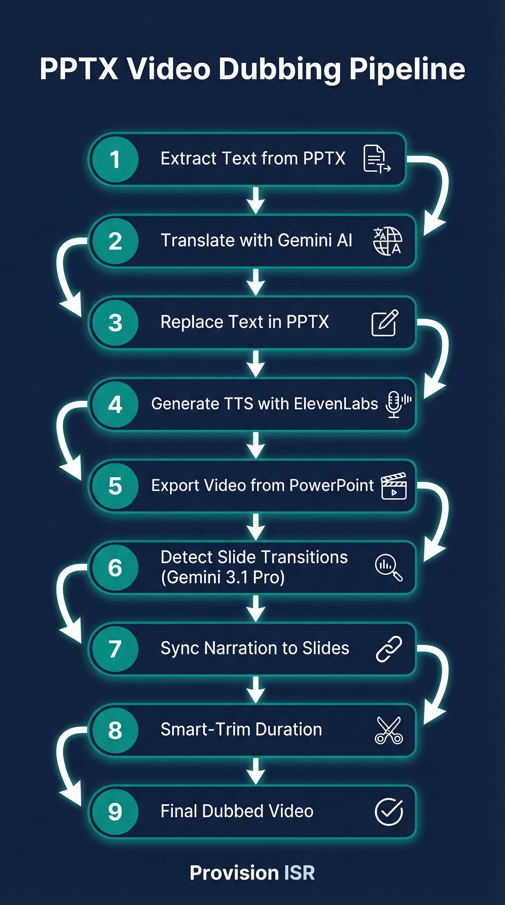

# Provision PPTX Dubbing

> Translate PowerPoint presentations and create dubbed video versions with synchronized narration.



## What it does

- Translates PPTX slide text and speaker notes while preserving all formatting and animations
- Generates natural-sounding narration audio per slide using ElevenLabs TTS
- Exports the translated PPTX to video via PowerPoint COM automation
- Detects slide transitions using Gemini 3.1 Pro vision analysis
- Syncs narration audio to slide timestamps and assembles the final dubbed video with smart-trim

## Quick Install

```bash
# Clone into Claude Code skills directory
cd ~/.claude/skills
git clone https://github.com/guyaga/provision-pptx-dubbing.git

# Restart Claude Code - the skill is auto-detected!
```

## Prerequisites

- **Python 3.10+**
- **Microsoft PowerPoint** (for COM automation video export)
- **FFmpeg** installed and on PATH ([download](https://ffmpeg.org/download.html))
- **PowerShell 5.1+** (Windows)
- **Google Gemini API key**
- **ElevenLabs API key**

## Setup

1. Get your API keys:
   - **Google Gemini** (free): https://aistudio.google.com → Get API Key
   - **ElevenLabs**: https://elevenlabs.io → Profile → API Keys

2. Install Python packages:
   ```bash
   pip install python-pptx google-genai elevenlabs requests
   ```

3. Create a project folder and add your config:
   ```bash
   mkdir my-project && cd my-project
   mkdir -p input translated narration video/frames output
   ```

4. Create `config.json`:
   ```json
   {
     "gemini_api_key": "YOUR_GEMINI_API_KEY",
     "elevenlabs_api_key": "YOUR_ELEVENLABS_API_KEY",
     "source_pptx": "input/presentation.pptx",
     "target_language": "Spanish",
     "elevenlabs_voice_id": "YOUR_VOICE_ID",
     "elevenlabs_model_id": "eleven_multilingual_v2",
     "gemini_model_translation": "gemini-2.0-flash",
     "gemini_model_vision": "gemini-3.1-pro",
     "frame_extraction_interval": 0.5
   }
   ```

5. Place your `.pptx` file in the `input/` folder.

## Usage

Open Claude Code in your project folder and say:
```
Translate my presentation to Spanish and create a dubbed video
```

Or use the skill command:
```
/provision-pptx-dubbing
```

## How it works

1. **Extract & Translate** - Open the PPTX, extract all slide text, translate via Gemini, replace text preserving formatting, save translated PPTX
2. **Generate Narration** - Send translated text to ElevenLabs TTS, save individual MP3 files per slide
3. **Export to Video** - Use PowerPoint COM automation (via PowerShell) to export the translated PPTX as MP4
4. **Detect Slide Transitions** - Extract frames from the video and send to Gemini 3.1 Pro for frame-by-frame analysis to find exact transition timestamps
5. **Sync & Assemble** - Map narration audio to detected slide timestamps, overlay audio onto the video
6. **Smart-Trim** - Trim slides with excess duration (dead air, long animations) to match target length
7. **Final Output** - Produce the final dubbed video with synced narration

## Files included

| File | Description |
|------|-------------|
| `skill.md` | Skill definition for Claude Code |
| `guide_he.pdf` | Hebrew installation guide (PDF) |
| `infographic.png` | Visual pipeline diagram |
| `templates/` | Ready-to-use Python and PowerShell scripts |

## Templates

| File | Description |
|------|-------------|
| `templates/translate_pptx.py` | PPTX text extraction and translation via Gemini |
| `templates/generate_narration.py` | ElevenLabs TTS narration generation per slide |
| `templates/export_pptx_video.ps1` | PowerShell script for PowerPoint COM video export |
| `templates/detect_transitions.py` | Gemini 3.1 Pro vision-based slide transition detection |
| `templates/sync_and_assemble.py` | Audio synchronization and final video assembly |
| `templates/config.json` | Configuration template with all available options |

## Built for

[Provision ISR](https://provisionisr.com) - Security camera and NVR solutions

## Powered by

- **Gemini 3.1 Pro** - Translation & slide transition detection
- **ElevenLabs** - Text-to-speech narration
- **FFmpeg** - Video processing & audio assembly

---

*Built with Claude Code*
